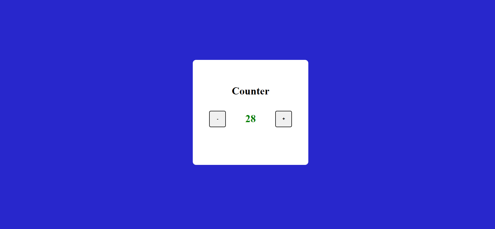

## What to build

we have to build Basic Counter

## Input

## Techanology used

we have used HTML, CSS and JavaScript DOM

## What I have learned from this project

I have learned how to decrease and increase value of element of HTML on clicking decreasing and increasing button.

## Output

## And

### Instructor

**Hitesh choudhary**
